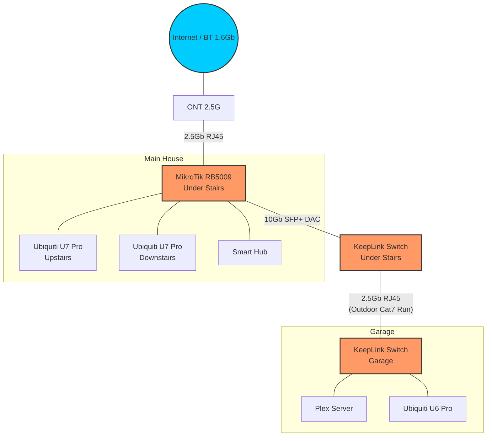

# Network Topology

The network is built around a high-speed backbone designed to support a 1.6Gbps FTTP connection. A 10Gbps SFP+ link connects the core router to the primary house switch, providing a non-blocking path for all internal and external traffic.

## Internet Connection

- **Provider:** BT Openreach (FTTP)
- **Speed:** 1.6 Gbps Down / 250 Mbps Up
- **ONT:** Nokia 2.5G ONT connected to the RB5009's 2.5G port (`ether1`).
- **WAN Protocol:** PPPoE

## Core Hardware

### MikroTik RB5009UPr+S+IN
- **Role:** Core Router / Gateway.
- **Location:** Under the stairs.
- **WAN Port:** `ether1` (2.5GbE).
- **Backbone:** `sfp-sfpplus1` (10GbE) connected to the House KeepLink switch.
- **Local PoE:** Powers the downstairs AP and Smart Hub directly.

### KeepLink House Switch (KP-9000-9XHPML-X)
- **Role:** Primary distribution switch for the house.
- **Location:** Under the stairs.
- **Uplink:** 10Gb SFP+ to RB5009.
- **Downlink:** 2.5Gb RJ45 to Garage via external Cat7 run.

### KeepLink Garage Switch (KP-9000-9XHPML-X)
- **Role:** Garage distribution and PoE.
- **Location:** Garage.
- **Uplink:** 2.5Gb RJ45 from House Switch.

## Wireless (Ubiquiti)

- **U7 Pro (Upstairs):** Connected to House Switch (2.5GbE).
- **U7 Pro (Downstairs):** Connected to RB5009 (1GbE).
- **U6 Pro (Garage):** Connected to Garage Switch (1GbE).
