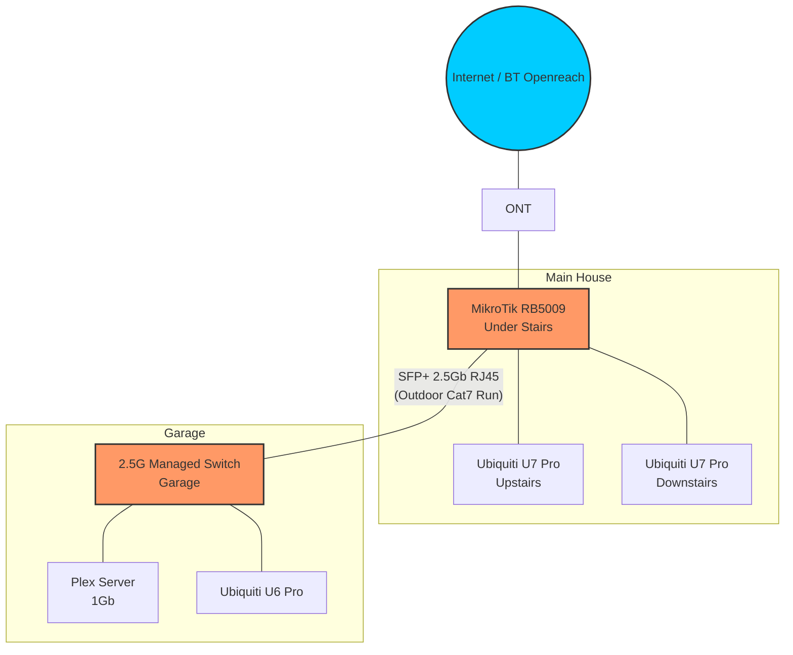
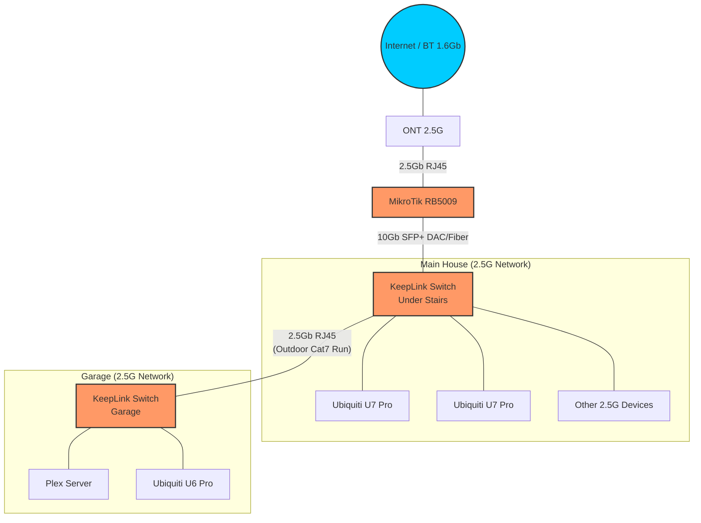

# Network Topology

## Internet Connection

- **Provider:** BT Openreach (FTTP)
- **ONT:** Connected directly to RB5009.

## Core Hardware

### MikroTik RB5009UPr+S+IN
- Primary router and PoE provider for main house APs.
- **Location:** Under the stairs.
- **SFP+ Port:** Equipped with a 2.5Gb SFP-to-RJ45 module.
- **Uplink to Garage:** A physical Cat7 cable run from under the stairs, routed outside the house, connecting to the Garage Switch.

### Garage 2.5G Switch
- **Location:** Garage.
- **Uplink:** 2.5Gb copper link via the Cat7 run from the RB5009 SFP+ port.
- **Connected Devices:**
    - **Plex Server:** 1Gb link.
    - **Ubiquiti U6 Pro:** PoE.

## Wireless (Ubiquiti)

- **U7 Pro (Upstairs):** Connected to RB5009.
- **U7 Pro (Downstairs):** Connected to RB5009.
- **U6 Pro (Garage):** Connected to Garage Switch.

---

# Proposed Upgrade: 1.6Gb Internet

To support the 1.6Gb (2.5Gb ONT) internet upgrade, the network will be restructured to free up the RB5009's single 2.5G RJ45 port for the WAN connection.

## Planned Changes

1.  **Add 2nd KeepLink (House):** Install under the stairs next to the RB5009.
2.  **10Gb Backbone:** Connect RB5009 SFP+ port to House KeepLink SFP+ port (10Gb link).
3.  **WAN Upgrade:** Move ONT to the RB5009 2.5G port (previously used for garage uplink).
4.  **Garage Uplink:** Move the Garage Cat7 run to a 2.5G port on the House KeepLink.

